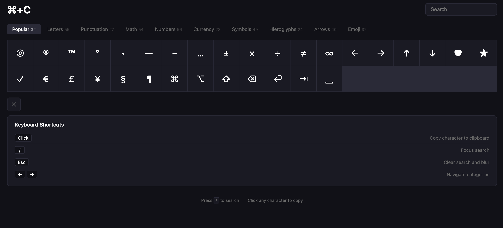

# commandc

Find and copy special characters to your clipboard. Click or tap on a character and it will be copied.



## Features

- 10 categories: Popular, Letters, Punctuation, Math, Numbers, Currency, Symbols, Hieroglyphs, Arrows, Emoji
- Search across all characters by name
- Click to copy with visual feedback
- Keyboard shortcuts (`/` search, `?` shortcuts, `← →` navigate)
- Dark theme
- Responsive design

## Keyboard Shortcuts

| Key | Action |
|-----|--------|
| `Click` | Copy character to clipboard |
| `/` | Focus search |
| `Esc` | Clear search and blur |
| `← →` | Navigate categories |
| `?` | Toggle shortcuts panel |

## Development

```bash
npm install
npm run dev
```

## Quality gates

```bash
npm run check  # lint + typecheck + test:coverage + build
```

## Architecture

Hexagonal architecture with ports and adapters:

- `src/domain/` — pure types, data sets, search logic
- `src/domain/ports/` — Clipboard and Notifier interfaces
- `src/application/` — use cases (CopyCharacter, FilterByCategory, SearchCharacters)
- `src/adapters/` — BrowserClipboard, test doubles
- `src/ui/` — React components

## License

MIT
